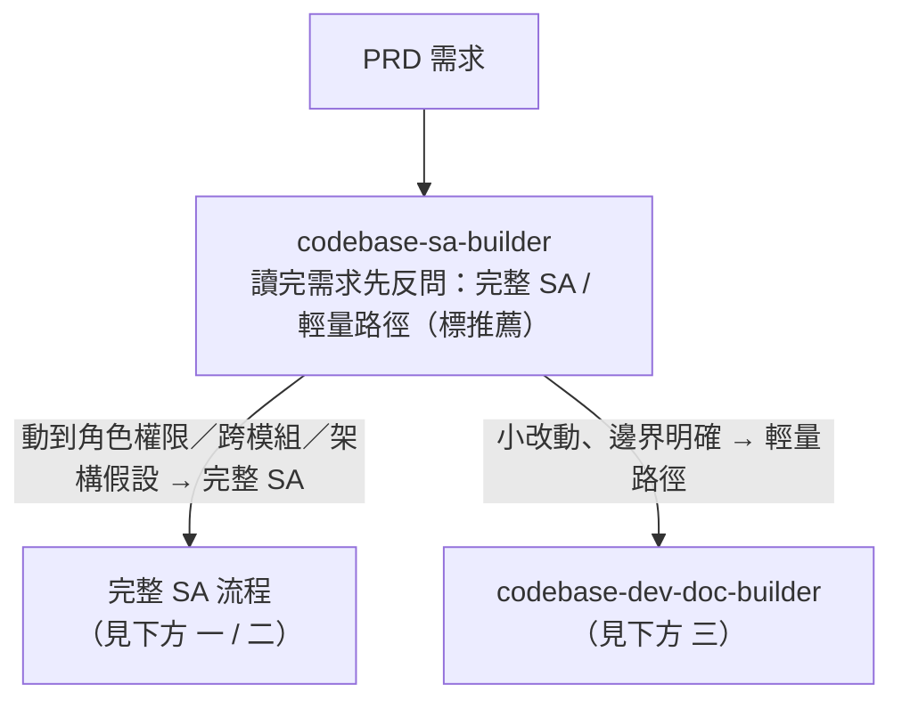
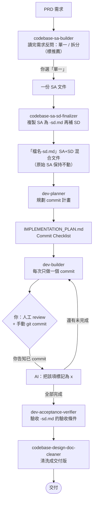
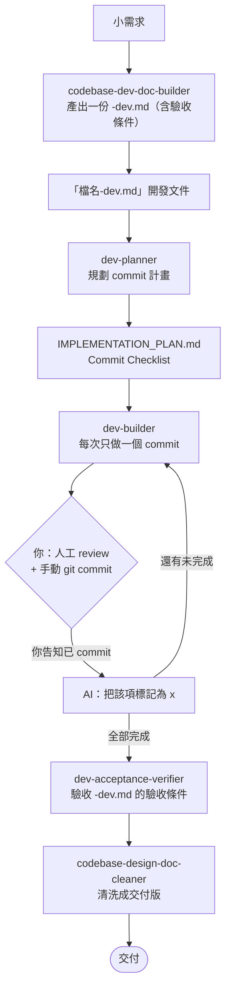

# spec-flow

套件版本：`v0.2.2`  
更新時間：2026-06-25
<!-- 版本對齊 plugins/spec-flow/.claude-plugin/plugin.json，發版時一併更新此處版本與日期 -->

---

安裝教程：[INSTALL.md](./INSTALL.md)

Spec 驅動的 Workflow —— 一組會互相銜接的 skill，從需求一路走到交付。可同時安裝到 **Claude Code** 與 **Codex**，兩邊都顯示為同一組 `spec-flow`。

本 repo 是一個 plugin marketplace，repo 根目錄即 marketplace 根目錄，plugin 本體在 `plugins/spec-flow/`。

## 這是什麼、適合誰

spec-flow 是一條 **spec 驅動的開發工作流**：從 PRD 一路走到實作與交付，途中以可追溯、可驗收的 SA / SD 文件作為骨幹。重心是「**把需求穩穩開發到交付**」，而 SA / SD 文件能完整留存、可審閱、可對外交付——是它和「只把程式寫出來」的工具最大的不同。

| | spec-flow（本專案） | superpowers (obra) | spec-kit (github) |
| --- | --- | --- | --- |
| 定位 | spec 驅動的開發工作流（文件留存） | Agent 行為框架 | 通用 spec 流程 |
| 流程 | SA→SD→plan→build→verify→clean | brainstorm→plan→TDD→review | constitution→specify→plan→tasks→implement |
| 主要產出 | SA / SD 交付文件（含驗收條件） | 程式碼，搭配計畫與 code review | spec.md / plan.md / tasks.md |
| 強項 | 來源追溯、對外交付清洗、大需求模組拆分（1 母 N 子） | 紀律化開發（TDD、系統化除錯、平行 subagent） | 結構化 spec 指令、跨工具（Copilot / Gemini / Claude） |
| 執行模式 | 人工駕馭、逐步 review 提交 | 自動連續執行 | 自動連續執行 |
| 生態 | 本身為 GitHub plugin marketplace | 已進官方 plugin marketplace | GitHub 官方維護 |

> **依賴 GitNexus**：分析既有專案時，SA / SD 階段透過 GitNexus 的程式碼知識圖譜查找相關現況（受影響模組、資料流、既有實作），讓設計與實際 codebase 對齊。全新專案則不需要。安裝方式見 [INSTALL.md](./INSTALL.md)。

## 可與其他 skill 自由組合

spec-flow 全程**以人工駕馭、逐步 review**（每個分叉自己選、每個 commit 人工 review 後手動提交），不會自動把流程一路跑完。這正是它的一項優勢：流程是開放、可介入的，你能在任一階段自然地接上其他 skill，而不會互相搶方向。

例如 spec-flow 沒有、但可在開發階段順手搭配的 superpowers skill：

- `systematic-debugging`：卡 bug 時的系統化根因分析。
- `verification-before-completion`：收尾前的自我驗證。

（dev-builder 已內建 commit 範圍內的 TDD，故不需另外引入 superpowers 的 `test-driven-development`。）

## 這組有哪些 skill

| Skill | 階段 | 做什麼 |
| --- | --- | --- |
| `codebase-sa-builder` | 需求分析（入口） | 讀完 PRD 先反問完整 SA / 輕量路徑；走完整則產出架構層級 SA，再反問單一 / 拆分（拆分產出 1 母文件 + N 模組 SA） |
| `codebase-dev-doc-builder` | 輕量路徑（小改動） | 規模小、邊界明確時產出一份 `-dev.md`（含驗收條件），直接交給 `dev-planner`，不經 SA/SD |
| `codebase-sa-sd-finalizer` | 補系統設計 | 把一份 SA 複製為 `-sd.md`，收斂 SA + 補 SD + 產生驗收條件 |
| `dev-planner` | 規劃 commit | 由 `-sd.md` 規劃 atomic commit 計畫 |
| `dev-builder` | 寫程式 | 每次做一個 commit（涉及行為邏輯時 commit 範圍內測試先行）、給你 git 指令；不自己 commit |
| `dev-acceptance-verifier` | 驗收 | 逐條驗收條件判定（通過／不通過／需人工確認），唯讀 |
| `codebase-design-doc-cleaner` | 交付清洗 | 移除來源標記與待釐清事項，產出乾淨交付版 |

> 調用方式與一般 skill 相同：AI 依各 skill 的 description 自動觸發，你也可指名調用。每支跑完會主動引導下一步、以及遇到問題時往上修正的去向（純引導、不自動調用下一支）。

---

## 進入點：規模判斷（第一個分叉）

`codebase-sa-builder` 讀完 PRD 後，**先**依「是否動到角色權限 / 跨模組依賴 / 既有架構假設」反問你走哪條路；走完整 SA 才會再有第二個「單一 / 拆分」分叉。

## 一、不拆分（單一文件）

## 二、拆分（1 母文件 + N 模組）

## 三、輕量路徑（小改動，不經 SA/SD）

規模小、邊界明確、不動角色權限 / 跨模組 / 架構假設的需求（小功能增修、欄位調整、單一規則修改等），不走完整 SA/SD，改產出一份精簡但仍可追溯、可驗收的 `-dev.md`。

> 若 `codebase-dev-doc-builder` 過程中發現需求其實會動到架構、角色權限或跨模組，會停下來導引你改走完整 SA 流程（一 / 二）。

## 怎麼使用

- **第一個分叉：完整 SA / 輕量路徑**：`codebase-sa-builder` 讀完 PRD 後先反問規模（含推薦項）。小改動走輕量 `-dev.md`；其餘走完整 SA，並再有第二個「單一 / 拆分」分叉。
- **拆分流程**：`finalizer → dev-planner → dev-builder → verifier` 這一輪**每個模組各跑一次**，全部模組完成後，最後才對母文件做一次跨模組驗收。
- **你（人）固定要介入**：① 選完整 / 輕量、（完整時）再選單一 / 拆分；② 每個 commit 人工 review + 手動 `git commit` 並回告 AI 才標記完成；③ 拆分時各模組與母文件的 verifier、cleaner 由你個別調用。
- **開發中要改東西（活文件，往上修）**：commit 級回 `dev-planner`；SD 設計級回 `codebase-sa-sd-finalizer`；需求／模組分解級回 `codebase-sa-builder`（改 SA／母文件，改完回 finalizer 同步 `-sd.md`，就地更新不刪檔）；輕量路徑則文件級回 `codebase-dev-doc-builder` 改 `-dev.md`。
- 原始 SA／母文件：下游 skill 一律不寫，只有 `codebase-sa-builder` 能改。

---

