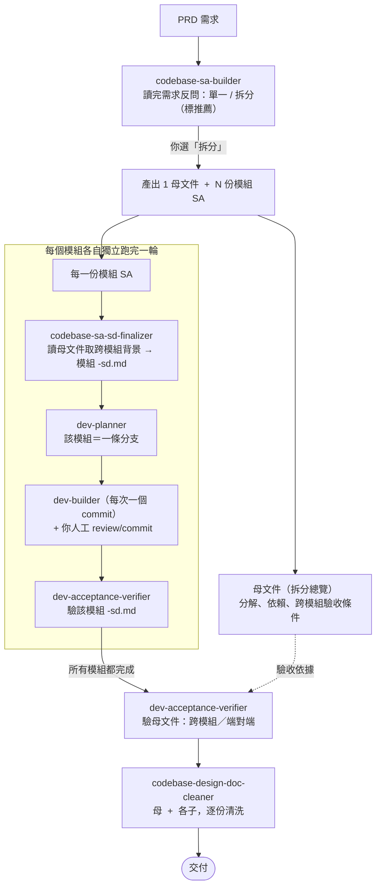

# spec-flow

安裝教程：[連結](./INSTALL.md)

Spec 驅動的開發管線 —— 一組會互相銜接的 skill，從需求一路走到交付。可同時安裝到 **Claude Code** 與 **Codex**，兩邊都顯示為同一組 `spec-flow`。

本 repo 是一個 plugin marketplace，repo 根目錄即 marketplace 根目錄，plugin 本體在 `plugins/spec-flow/`。

## 這組有哪些 skill

| Skill | 階段 | 做什麼 |
| --- | --- | --- |
| `codebase-sa-builder` | 需求分析（入口） | 由 PRD 產出架構層級 SA；反問單一 / 拆分（拆分產出 1 母文件 + N 模組 SA） |
| `codebase-sa-sd-finalizer` | 補系統設計 | 把一份 SA 複製為 `-sd.md`，收斂 SA + 補 SD + 產生驗收條件 |
| `dev-planner` | 規劃 commit | 由 `-sd.md` 規劃 atomic commit 計畫 |
| `dev-builder` | 寫程式 | 每次做一個 commit、給你 git 指令；不自己 commit |
| `dev-acceptance-verifier` | 驗收 | 逐條驗收條件判定（通過／不通過／需人工確認），唯讀 |
| `codebase-design-doc-cleaner` | 交付清洗 | 移除來源標記與待釐清事項，產出乾淨交付版 |

> 調用方式與一般 skill 相同：AI 依各 skill 的 description 自動觸發，你也可指名調用。每支跑完會主動引導下一步、以及遇到問題時往上修正的去向（純引導、不自動調用下一支）。

---

## 一、不拆分（單一文件）

## 二、拆分（1 母文件 + N 模組）

## 怎麼使用

- **唯一的分叉點在第一步**：`codebase-sa-builder` 讀完 PRD 後一律反問你「單一 / 拆分」（含推薦項），決定走哪一條。
- **拆分流程**：`finalizer → dev-planner → dev-builder → verifier` 這一輪**每個模組各跑一次**，全部模組完成後，最後才對母文件做一次跨模組驗收。
- **你（人）固定要介入**：① 選單一 / 拆分；② 每個 commit 人工 review + 手動 `git commit` 並回告 AI 才標記完成；③ 拆分時各模組與母文件的 verifier、cleaner 由你個別調用。
- **開發中要改東西（活文件，往上修）**：commit 級回 `dev-planner`；SD 設計級回 `codebase-sa-sd-finalizer`；需求／模組分解級回 `codebase-sa-builder`（改 SA／母文件，改完回 finalizer 同步 `-sd.md`，就地更新不刪檔）。
- 原始 SA／母文件：下游 skill 一律不寫，只有 `codebase-sa-builder` 能改。

---

