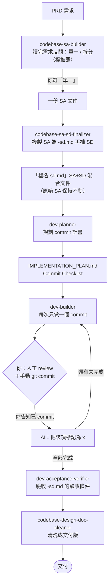
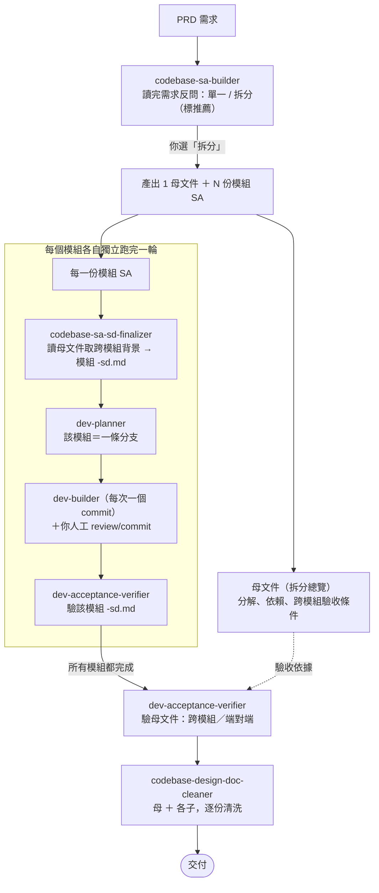

# Skill 工作流程

本目錄的 skill 是一條「需求 → 設計 → 實作 → 驗收 → 交付」的管線。

- **起手點永遠是 `codebase-sa-builder`**。它讀完需求後會反問你「單一 / 拆分」，你的選擇決定走下面哪一條流程。
- 你是**一階段一階段手動調用** skill 的，不是一鍵跑完。下面每步都標了「餵什麼 → 得到什麼」，照著走即可。
- 圖中標 **你** 的節點代表需要人介入；其餘為 skill 自動執行。

---

## Skill 一覽（會用到的 6 支）

| Skill | 階段 | 餵給它什麼 | 產出 / 結果 |
| --- | --- | --- | --- |
| `codebase-sa-builder` | 需求分析（入口） | PRD（文件 / 網址 / Issue） | 反問單一 / 拆分後，產出 SA 文件（單一＝一份；拆分＝1 母文件＋N 模組 SA） |
| `codebase-sa-sd-finalizer` | 補系統設計 | 一份 SA 文件 | 複製成 `<檔名>-sd.md`，在副本上收斂 SA＋補 SD＋合併驗收條件（**原 SA 不動**） |
| `dev-planner` | 規劃 commit | 一份 `-sd.md` | `.ai/<分支>/plan/IMPLEMENTATION_PLAN.md`（Commit Checklist） |
| `dev-builder` | 寫程式 | `IMPLEMENTATION_PLAN.md` | 每次做**一個** commit，給你 `git` 指令；**不自己 commit** |
| `dev-acceptance-verifier` | 驗收 | 一份 `-sd.md` 或母文件 | 逐條驗收條件判定（通過 / 不通過 / 需人工確認）＋報告（**唯讀**） |
| `codebase-design-doc-cleaner` | 交付清洗 | 要交付的文件（逐份） | 移除來源標記與待釐清事項，產出乾淨交付版 |

> 重要對應：**1 份 `-sd.md` = 1 條分支 = 1 份計畫**。拆分時，中間 `finalizer → dev-planner → dev-builder → verifier` 這一輪**每個模組各跑一次**。

---

## 一、不拆分（單一文件）

**逐步（餵什麼 → 得到什麼）**

1. `codebase-sa-builder` ← PRD → 選「單一」→ 一份 SA 文件。
2. `codebase-sa-sd-finalizer` ← 該 SA → `檔名-sd.md`（之後都用這份；原 SA 封存）。
3. `dev-planner` ← `-sd.md` → `IMPLEMENTATION_PLAN.md`。
4. `dev-builder` ← 計畫 → 做一個 commit、給你指令 →**你 review＋手動 commit →回告 AI 標 `[x]`**→ 重複到全部 `[x]`。
5. `dev-acceptance-verifier` ← `-sd.md` → 驗收報告。
6. `codebase-design-doc-cleaner` ← `-sd.md` → 乾淨交付版。

---

## 二、拆分（1 母文件 + N 模組）

**逐步（餵什麼 → 得到什麼）**

1. `codebase-sa-builder` ← PRD → 選「拆分」→ **1 母文件（總覽）＋ N 份模組 SA**。母文件是「地圖」，不往下做。
2. **對每一個模組** 各跑一輪：
   - `codebase-sa-sd-finalizer` ← 該模組 SA（會讀母文件取跨模組背景）→ 模組 `-sd.md`。
   - `dev-planner` ← 模組 `-sd.md` → 該模組的計畫（＝一條分支）。
   - `dev-builder` ← 計畫 → 逐 commit，**你 review＋手動 commit＋回告標 `[x]`**。
   - `dev-acceptance-verifier` ← 模組 `-sd.md` → 該模組驗收報告。
3. **所有模組都完成後**：`dev-acceptance-verifier` ← **母文件** → 跨模組／端對端驗收報告。
4. `codebase-design-doc-cleaner` ← 母文件與各模組交付文件，**逐份清洗**。

---

## 你（人）一定要做的事

1. **第一步選單一 / 拆分**（sa-builder 會給選項與推薦）。
2. **每個 commit**：人工 review + 手動 `git commit`，並**回告 AI** 才會把該項標成 `[x]`（dev-builder 不會自己 commit、也不會自己標完成）。
3. **拆分時**：逐模組的 finalizer / planner / builder / verifier，以及最後母文件的 verifier、各份文件的 cleaner，**都由你個別調用**。

---

## 開發中要改東西時（活文件，往上修）

改動要回到「對的那一層」，低層不要硬改高層：

| 變動層級 | 回哪一支 | 之後 |
| --- | --- | --- |
| 某個 commit 拆錯 / 要補 | `dev-planner`（改該分支計畫） | 繼續 dev-builder |
| SD 系統設計要調 | `codebase-sa-sd-finalizer`（改該 `-sd.md`） | 回 dev-planner 重規劃 |
| 需求 / 架構 / 模組分解要改 | `codebase-sa-builder`（改 SA 或母文件） | **重跑 finalizer 同步 `-sd.md`**（就地更新、**不刪檔重建**） |

> 原始 SA / 母文件：**下游 skill 一律不寫，只有 `codebase-sa-builder` 能改**。改完務必回 finalizer 把 `-sd.md` 同步。
